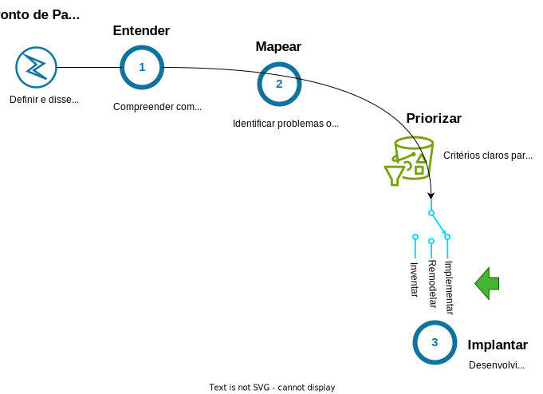

# Priorizar - anterior

Ter uma resposta clara para "Quais problemas ou oportunidades queremos abordar com a IA?" é um passo essencial para o sucesso da implementação da IA na organização. A atividade de ideação apresentada anteriormente joga luz sobre essa questão. No entanto, para evitar vieses na escolha dos projetos, é importante realizar um processo de seleção e priorização baseado em critérios que maximizem o impacto e o retorno sobre o investimento. A seguir, apresento algumas ideias de critérios que podem guiar esse processo de seleção, visando escolhas estratégicas e alinhadas com os objetivos da empresa.

## Estabelecendo critérios
**1. Alinhamento Estratégico:**
Escolha ideias que estejam diretamente alinhadas com a visão e os objetivos estratégicos da empresa. A implementação de IA deve fortalecer as áreas prioritárias e contribuir para a vantagem competitiva da organização. Pergunte-se: "Esta ideia apoia nossa missão de longo prazo?"

**2. Retorno sobre o Investimento (ROI):**
Avalie o potencial de retorno financeiro de cada ideia. Priorize aquelas que ofereçam um alto ROI, considerando tanto os benefícios diretos quanto os indiretos, como aumento de eficiência, redução de custos e melhoria na experiência do cliente. Pergunte-se: "Qual será o impacto financeiro desta implementação nos próximos anos?"

**3. Viabilidade Técnica:**
Examine a viabilidade técnica das ideias. Considere a maturidade da tecnologia necessária, a disponibilidade de dados de qualidade e a capacidade da equipe interna para desenvolver e implementar a solução. Pergunte-se: "Nossa equipe e infraestrutura estão prontas para esta tecnologia?"

**4. Escalabilidade:**
Priorize ideias que possam ser escaladas em toda a organização. A capacidade de expandir a solução para diferentes departamentos ou unidades de negócio é essencial para maximizar o impacto positivo da IA. Pergunte-se: "A solução pode ser adaptada para diferentes contextos e necessidades dentro da empresa?"

**5. Impacto no Cliente:**
Considere o impacto potencial no cliente. Ideias que melhoram significativamente a experiência do cliente ou agregam valor direto ao usuário final devem ser altamente priorizadas. Pergunte-se: "Como nossos clientes serão beneficiados por esta implementação?"

**6. Risco e Complexidade:**
Avalie o risco associado a cada ideia, incluindo fatores como a complexidade do projeto, o tempo de implementação e possíveis barreiras regulatórias. Opte por ideias que apresentem um equilíbrio saudável entre risco e benefício. Pergunte-se: "Quais são os riscos e como podemos mitigá-los?"

**7. Capacidade de Medição e Monitoramento:**
Escolha ideias que permitam a medição clara de resultados e impactos. A capacidade de monitorar e ajustar a implementação com base em dados reais é fundamental para garantir o sucesso contínuo do projeto. Pergunte-se: "Podemos medir e acompanhar o desempenho desta solução?"

**8. Integração com Sistemas Existentes:**
Considere a facilidade de integração das novas soluções de IA com os sistemas e processos existentes. Ideias que exigem menos reestruturação e podem ser integradas de maneira fluida tendem a ser mais viáveis e menos disruptivas. Pergunte-se: "Como esta solução se encaixa em nossa infraestrutura atual?"

Aplicando esses critérios de forma cuidadosa, você permitirá que as melhores ideias de utilização da IA sejam selecionadas, permitindo que os recursos da empresa sejam investidos de forma estratégica e eficiente, gerando resultados significativos e duradouros. O estabelecimento e utilização de critérios das ideias de projeto não apenas maximiza o impacto positivo da IA, mas também assegura que cada passo dado esteja alinhado com a visão e os objetivos da organização.

# Agrupando as propostas de projeto
Para organizar as propostas selecionadas, sugiro dividir as iniciativas em três grupos principais: Implementar, Remodelar e Inventar. Essa abordagem permite um planejamento mais organizado, seja para quem está começando ou para quem já está utilizando IA em sua organização.

**Implementar**: Introduzir a IA no dia a dia da empresa.
  **Remodelar**: Redesenhar funções críticas para aumentar a eficiência e eficácia.
  **Inventar**: Criar novas experiências, ofertas e modelos de negócios impulsionados pela IA.

Não existe uma estratégia única ou receita de bolo para a implantação da IA. No entanto, ao organizar suas iniciativas nos grupos Implementar, Remodelar e Inventar, você pode construir uma base sólida para a adoção da IA em sua empresa. Se a sua organização ainda não tem experiência com IA, comece com ferramentas de IA generativa para ganho rápido de produtividade e, à medida que sua organização acumula experiência, expanda para a IA preditiva e explore novas possibilidades de inovação.

## Implementar
A IA Generativa já está transformando a experiência de trabalho diária. Assistentes habilitados por GenAI permitem que os colaboradores criem e-mails e apresentações rapidamente. Ferramentas automatizadas podem resumir reuniões e chamadas em segundos, liberando tempo para trabalhos mais criativos e de maior valor agregado.

As mudanças vão além disso. Fornecedores de software estão oferecendo soluções cada vez mais atrativas que aumentam a eficiência diária, como categorização de e-mails e engajamento mais preciso com clientes. A implantação ampla de diversas soluções e modelos de GenAI pode aumentar significativamente a produtividade. Segundo pesquisa da BCG, ferramentas de GenAI podem proporcionar ganhos de produtividade de 10% a 20% ou mais em toda a empresa.

## Remodelar
Implementar ferramentas de GenAI para produtividade é essencial, mas não suficiente. Oportunidades mais substanciais surgem quando as organizações redefinem processos e funções.

Os ganhos do grupo de projetos associados a iniciativa de Remodelar são evidentes em áreas como atendimento ao cliente, marketing, desenvolvimento de software, mas também em áreas inesperadas como serviços de campo e engenharia. Embora projetos  para Remodelar funções possam representar desafios dado o seu impacto em fluxos e processos enraizados na organização, os benefícios são inegáveis. Voltando à pesquisa da BCG, a GenAI pode oferecer ganhos de eficiência de 30% a 50%, sendo que o impressionante 50% foi atingido em um processo de remodelação de um call center usando GenAI.

Os ganhos dos projetos associados à iniciativa de Remodelar são evidentes em áreas como atendimento ao cliente, marketing e desenvolvimento de software, mas também em áreas inesperadas como serviços de campo e engenharia. Embora projetos para remodelar funções possam representar desafios, dado o seu impacto em fluxos e processos enraizados na organização, os benefícios são inegáveis. Segundo a pesquisa da BCG, a GenAI pode oferecer ganhos de eficiência de 30% a 50%, sendo que o impressionante valor de 50% foi atingido em um processo de remodelação de um call center usando GenAI.

## Inventar
A IA Generativa vai além do aumento da produtividade. Ela pode ajudar a reinventar experiências de clientes, criar novos serviços e ofertas, e até mesmo desenvolver novos modelos de negócios.

Ao agrupar as iniciativas em Implementar, Remodelar e Inventar, você não apenas organiza melhor os projetos, mas também estabelece uma base estratégica robusta para a adoção da IA. Esta abordagem permite que sua empresa maximize o impacto positivo da IA, alavancando ganhos de produtividade imediatos, redesenhando processos críticos para maior eficiência e explorando novas fronteiras de inovação. Com uma estrutura clara e um plano bem definido, sua organização estará preparada para aproveitar plenamente as oportunidades proporcionadas pela IA, promovendo crescimento sustentável e vantagem competitiva no mercado.

